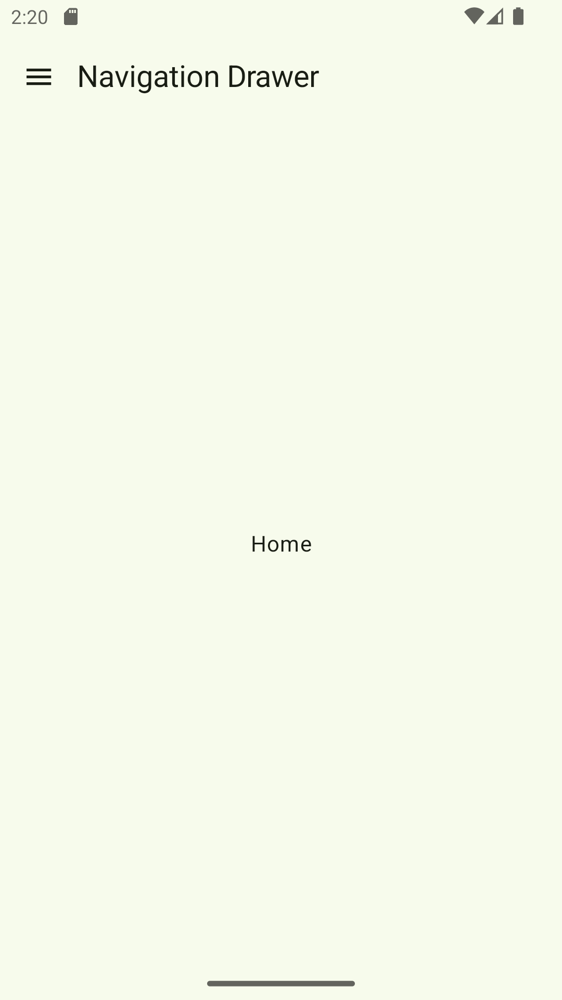
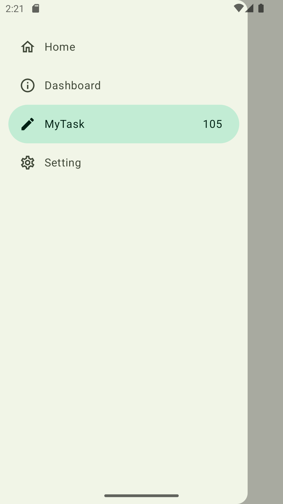
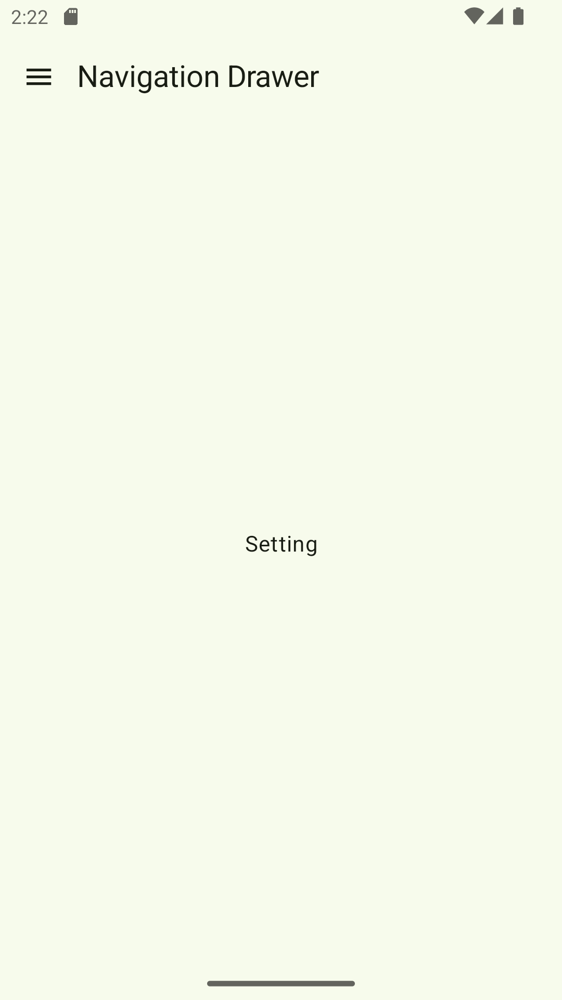

# Navigation-Drawer-JetpackCompose
Navigation Drawer Provide access to the top-level destination of the Android application 

## 🌳 Environment
Android Studio verison used : ``Android Studio Ladybug | 2024.2.1 Patch 2``

## 🖼️ OutPut Screens

| Default Screen | Drawer Open Screen | Setting Screen |
|----------------|--------------------|---------------|
|  |  | |
